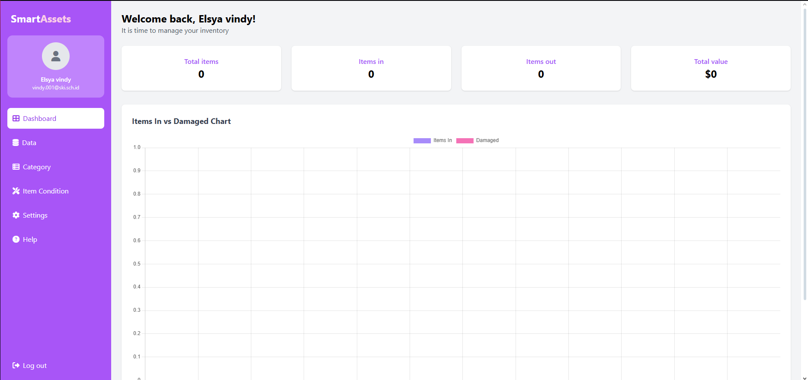

#Smartassets

Aplikasi smartassets digunakan untuk mengelola data item dengan mudah melalui fitur CRUD (Create, Read, Update, Delete).  
Proyek ini dibuat menggunakan Laravel dan Tailwind CSS dengan desain sidebar responsif untuk memudahkan navigasi antar halaman.

Dengan adanya aplikasi ini, pengguna dapat menyimpan, memperbarui, dan menghapus data item secara efisien.

---

## ✨ Fitur
- Login & Register dengan autentikasi
- Dashboard dengan daftar item
- Sidebar navigasi responsif (Home, Items, Settings, Profile)
- CRUD item (Tambah, Edit, Hapus, Lihat detail)
- Notifikasi setelah melakukan aksi CRUD
- Tampilan menggunakan Tailwind CSS

---

## 🛠 Tech Stack
- Laravel 10
- Tailwind CSS
- MySQL
- Blade Templates

---

## 📸 Dokumentasi
-Dashbaord

-Login

-Register

