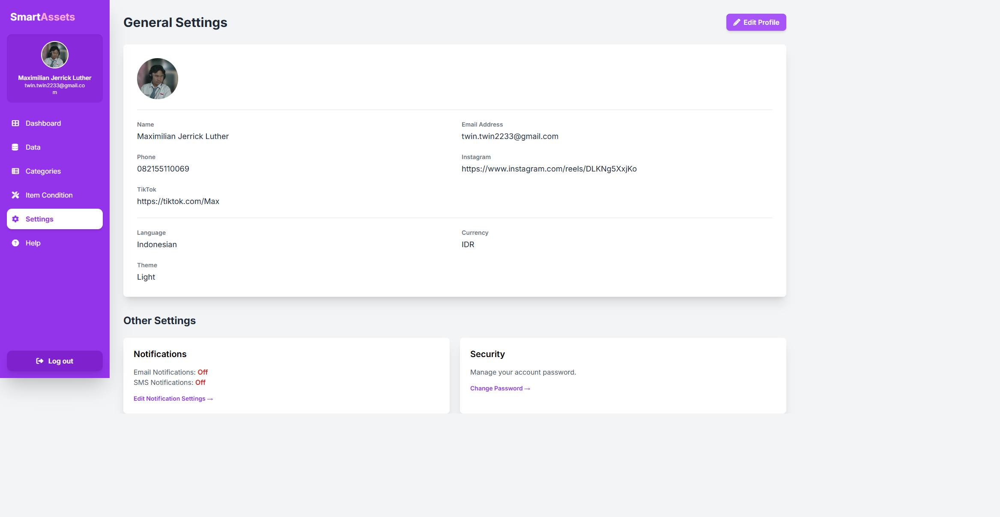

# SmartAssets 📦

**Aplikasi Inventaris Sekolah Sederhana**

Ini adalah project web untuk tugas manajemen barang inventaris sekolah. Aplikasi ini dibuat pakai **Laravel 10** dan **Tailwind CSS** biar tampilannya rapi. Intinya aplikasi ini bisa buat catat barang masuk, edit data, dan hapus data (CRUD).

### 🛠 Tools yang Dipake
* **Framework:** Laravel 10
* **Style:** Tailwind CSS
* **Database:** MySQL
* **Lainnya:** Chart.js (buat grafik simple)

### ✨ Fitur-fiturnya
* **Login & Register:** Biar datanya aman.
* **Dashboard:** Ada info total barang sama grafik simpel.
* **CRUD Barang:** Bisa tambah, lihat, edit, dan hapus barang.
* **Kategori & Kondisi:** Bisa atur jenis barang dan kondisinya (Baik/Rusak).
* **Profil:** Bisa ganti foto profil user.

---

### 🚀 Cara Install (Di Localhost)

Kalo mau coba jalanin di laptop, ikutin langkah ini ya:

1.  **Clone & Install**
    ```bash
    git clone [https://github.com/username-anda/smartassets.git](https://github.com/username-anda/smartassets.git)
    cd smartassets
    composer install
    npm install
    ```

2.  **Setting Database**
    * Copy file `.env.example` jadi `.env`.
    * Bikin database baru di MySQL (misal namanya `smartassets`).
    * Sesuaikan di file `.env`:
        ```env
        DB_DATABASE=smartassets
        DB_USERNAME=root
        DB_PASSWORD=
        ```

3.  **Migrate & Jalanin**
    Jalanin perintah ini di terminal:
    ```bash
    php artisan key:generate
    php artisan migrate
    php artisan storage:link
    ```

4.  **Start Server**
    Buka 2 terminal:
    ```bash
    # Terminal 1
    php artisan serve

    # Terminal 2
    npm run dev
    ```
    Terus buka `http://localhost:8000` di browser.

---

### 📸 Dokumentasi Aplikasi

**1. Dashboard**
Halaman utama yang menampilkan ringkasan statistik dan grafik inventaris 6 bulan terakhir.


**2. Halaman Login**
Halaman autentikasi untuk masuk ke dalam sistem.


**3. Halaman Register**
Halaman pendaftaran untuk pengguna baru.


**4. Daftar Data (Inventory)**
Halaman utama pengelolaan barang. Menampilkan tabel data dengan fitur pencarian dan paginasi.


**5. Manajemen Kategori**
Halaman untuk menambah, mengedit, dan menghapus kategori barang.


**6. Kondisi Barang**
Halaman untuk mengatur status kondisi barang.


**7. Pengaturan Profil (Settings)**
Halaman untuk mengubah foto profil, informasi kontak, dan preferensi aplikasi.


**8. Pusat Bantuan (Help)**
Halaman FAQ dan panduan penggunaan aplikasi.
