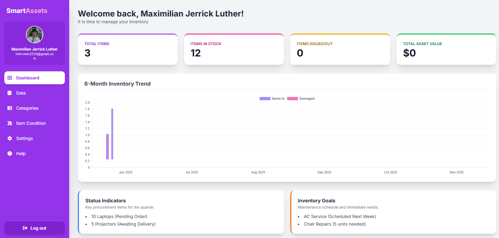
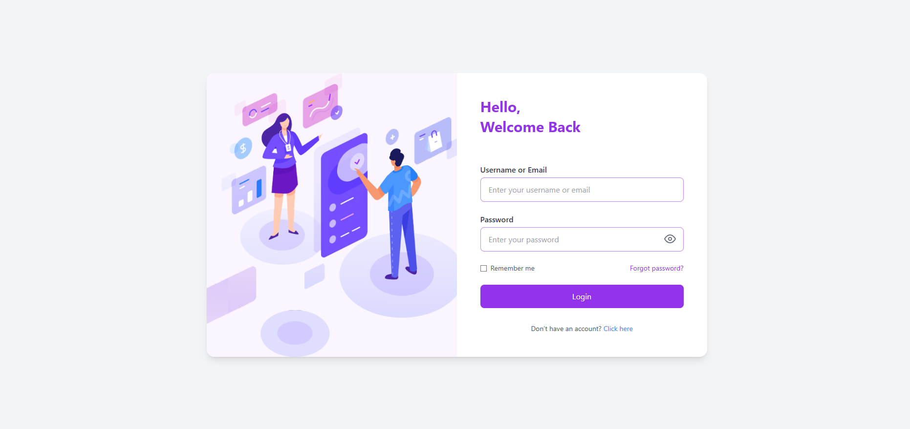
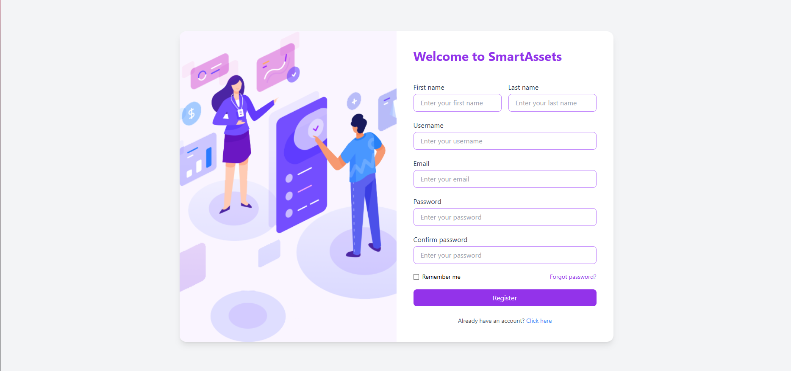
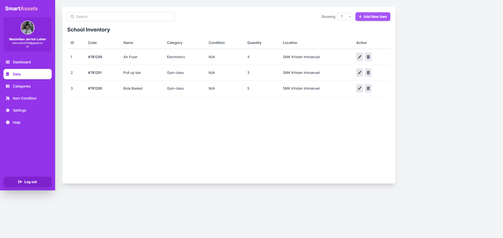
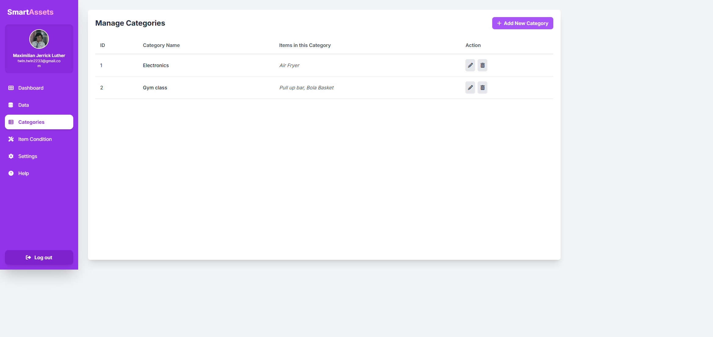
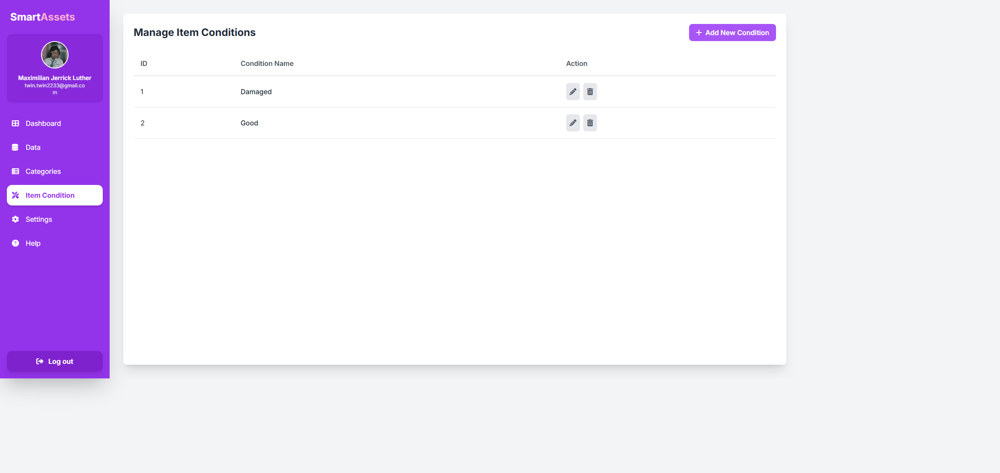
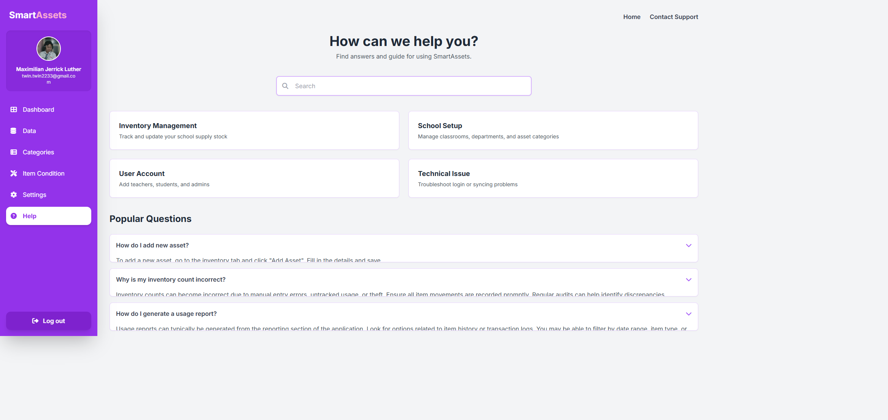

SmartAssets 📦

SmartAssets adalah aplikasi manajemen aset berbasis web yang dirancang untuk memudahkan pengelolaan data barang (inventaris) sekolah atau organisasi. Aplikasi ini menyediakan fitur CRUD (Create, Read, Update, Delete) yang lengkap, autentikasi pengguna yang aman, dan antarmuka yang modern serta responsif.

Dibangun dengan Laravel 10 dan Tailwind CSS, proyek ini menawarkan pengalaman pengguna yang cepat dan intuitif, lengkap dengan sidebar navigasi yang memudahkan akses ke berbagai modul aplikasi.

✨ Fitur Utama

🔐 Autentikasi Aman: Sistem Login dan Register bawaan untuk mengamankan akses data.

📊 Dashboard Interaktif: Ringkasan statistik inventaris (Total Item, Stok Masuk, Barang Keluar, Total Nilai Aset) dengan grafik visual.

📱 Desain Responsif: Tampilan yang menyesuaikan dengan berbagai ukuran layar (Desktop, Tablet, Mobile) menggunakan Tailwind CSS.

🛠 Manajemen Item (CRUD):

Menambah item baru dengan detail lengkap (Kode, Nama, Kategori, Kondisi, Lokasi).

Mengedit informasi item.

Menghapus item dengan konfirmasi keamanan.

Mencari dan memfilter item.

📂 Kategori & Kondisi: Manajemen data master untuk Kategori Barang dan Kondisi Barang.

👤 User Profile: Pengaturan profil pengguna termasuk foto profil, kontak, dan preferensi tema.

🔔 Notifikasi: Umpan balik visual (Flash Messages) setelah melakukan aksi (Berhasil/Gagal).

🗂 Entitas Utama

Aplikasi ini menggunakan beberapa entitas database utama untuk mengelola data:

Users: Menyimpan data autentikasi (nama, email, password).

Profiles: Data pelengkap pengguna (foto profil, no. telepon, sosial media, preferensi bahasa/mata uang). Relasi One-to-One dengan User.

Categories: Jenis pengelompokan barang (contoh: Elektronik, Furniture). Relasi One-to-Many dengan Items.

Conditions: Status kondisi fisik barang (contoh: Baik, Rusak, Perlu Perbaikan). Relasi One-to-Many dengan Items.

Items: Data inti inventaris yang mencakup kode unik, nama, jumlah, lokasi, serta relasi ke Kategori dan Kondisi.

🛠 Tech Stack

Aplikasi ini dibangun menggunakan teknologi modern berikut:

Framework: Laravel 10 (PHP)

Styling: Tailwind CSS

Database: MySQL

Templating: Blade Templates

Scripting: JavaScript (Chart.js untuk grafik, Vanilla JS untuk interaksi UI)

Icons: FontAwesome

🚀 Setup Database & Instalasi

Ikuti langkah-langkah berikut untuk menjalankan proyek ini di komputer lokal Anda:

Clone Repository

git clone [https://github.com/username-anda/smartassets.git](https://github.com/username-anda/smartassets.git)
cd smartassets

Install Dependencies

composer install
npm install

Konfigurasi Environment (Database)
Duplikat file .env.example menjadi .env. Buka file .env dan sesuaikan konfigurasi database MySQL Anda (pastikan database kosong dengan nama smartassets atau sesuai keinginan sudah dibuat di MySQL):

DB_CONNECTION=mysql
DB_HOST=127.0.0.1
DB_PORT=3306
DB_DATABASE=smartassets
DB_USERNAME=root
DB_PASSWORD=

Generate Key & Migrate Database
Jalankan perintah berikut untuk membuat tabel-tabel database (Users, Profiles, Items, Categories, Conditions):

php artisan key:generate
php artisan migrate
php artisan storage:link

Jalankan Aplikasi

npm run dev
php artisan serve

Buka http://localhost:8000 di browser Anda.

📸 Dokumentasi Aplikasi

Berikut adalah tampilan antarmuka dari aplikasi SmartAssets:

1. Dashboard

Halaman utama yang menampilkan ringkasan statistik dan grafik inventaris 6 bulan terakhir.

2. Halaman Login

Halaman autentikasi untuk masuk ke dalam sistem.

3. Halaman Register

Halaman pendaftaran untuk pengguna baru.

4. Daftar Data (Inventory)

Halaman utama pengelolaan barang. Menampilkan tabel data dengan fitur pencarian dan paginasi.

5. Manajemen Kategori

Halaman untuk menambah, mengedit, dan menghapus kategori barang.

6. Kondisi Barang

Halaman untuk mengatur status kondisi barang.

7. Pengaturan Profil (Settings)

Halaman untuk mengubah foto profil, informasi kontak, dan preferensi aplikasi.

8. Pusat Bantuan (Help)

Halaman FAQ dan panduan penggunaan aplikasi.

